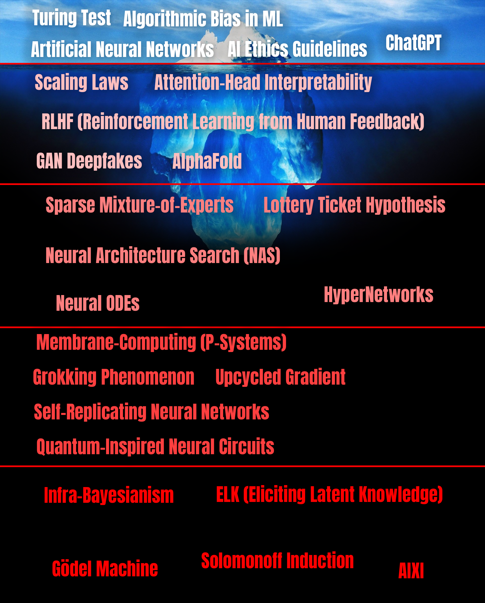

# 🧊 AI Iceberg 🧊



## What’s an "Iceberg" meme?

An **iceberg meme** is a layered diagram that starts with the familiar "tip" above the waterline and then dives into ever-deeper, ever-more-obscure territory.  
Here, each stratum represents a depth of **AI knowledge**—from everyday buzzwords at the top level down to deepest esoteric level.

---

## Contribute a new iceberg fact

We’d love your help expanding and refining the iceberg! To add (or edit) a concept:

1. **Fork** the repository and create a branch.  
2. **Edit** `src/entries.json`.  
   ```jsonc
   {
     "level": 0-4,                 // 0 = common, 4 = obscure
     "title": "Short label",
     "description": "One-sentence explainer",
     "source": "Paper / link / citation"
   }
3. Commit only the JSON change.
    
    ⚠️ Do not add the PNG—a GitHub Actions runner automatically rebuilds `images/iceberg.png` after your PR is merged.

4. Open a pull request. A brief note on what you added or changed is perfect.


Ideas for new entries, wording tweaks, layout improvements, or colour-palette experiments are all appreciated.
Open an issue or send a PR—let’s build the most comprehensive AI iceberg together 🚀